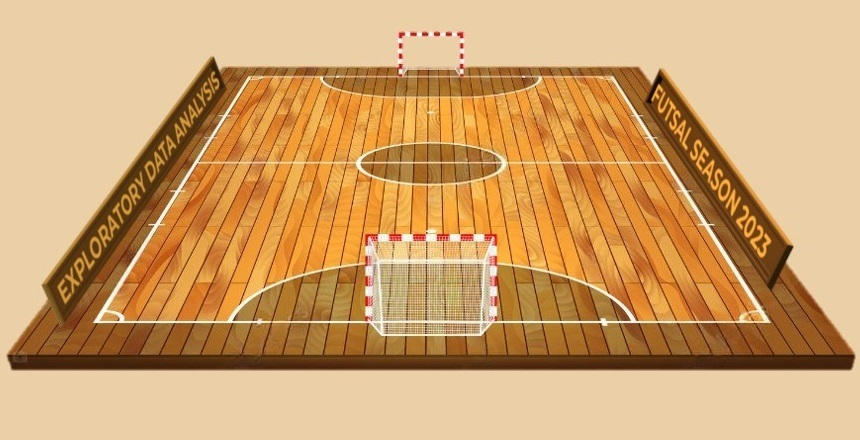
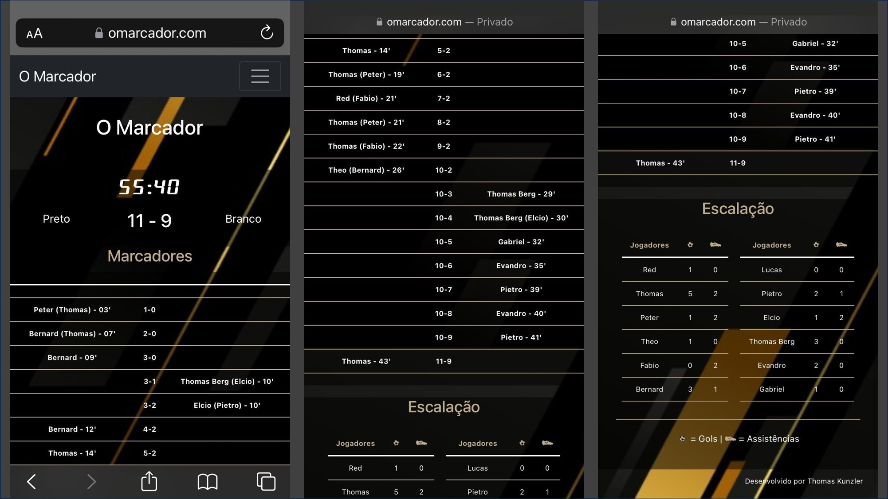

# Exploratory Data Analysis - Futsal 2023

This personal project involves analyzing data collected throughout 2023 from futsal matches I play weekly with a group of friends in Porto Alegre.

### Origin of the Idea
The idea came from a habit of my friend Gabriel, who always recorded his individual statistics from the matches, noting only the number of goals he scored and the final result (win, draw, or loss). During our conversations, we realized it would be interesting to record more data from our matches. However, we faced the challenge of not having an efficient mechanism to quickly collect and store this data during the games, in a way that all our friends would adopt this practice. With this problem in mind, I used my programming skills to find a solution.

### Data Collection
Collecting data during a futsal match without a dedicated person is a challenging task. No one wants to interrupt the game to note the score, time, goal scorers, and assist providers. It needs to be done quickly and with few clicks. My solution was to create the website www.omarcador.com, optimized for mobile devices, allowing us to store match data quickly and efficiently. Throughout 2023, we used O Marcador to collect data from all the matches we played.

In the image below, you can see a real example of a match played on June 20, 2023, where we used the website "omarcador.com" to record the match statistics.

### Data Analysis
By the end of the 2023 season, we had stored data from 41 games and 55 players. The data is organized into two files:

- "Futsal 2023 - Wins and Losses.xlsx": This file contains the final result of each match, categorizing the players according to the game's outcome.

- "Futsal 2023 - Goals.xlsx": This file includes detailed information about each goal scored during the year, including the score after the goal, time, goal scorer, and assist provider.

Throughout the analysis, we will cover player rankings, goal analyses and their characteristics, locations of the matches, individual player analyses, and more.

I have provided two versions of the analysis in the "notebooks" folder for you to choose how you want to follow along:

- 01_eda_original.ipynb - This is the original version of the Exploratory Data Analysis (EDA). It contains the code for creating tables and graphs directly within the notebook. However, these codes can sometimes be lengthy and may hinder the visualization process.

- 02_eda_clean.ipynb - This is the clean version of the Exploratory Data Analysis (EDA). For better organization and clarity, I have extracted the code for creating graphs and tables and placed it in a separate file ('auxiliary_functions.py') as functions, which can be called as needed.

 
